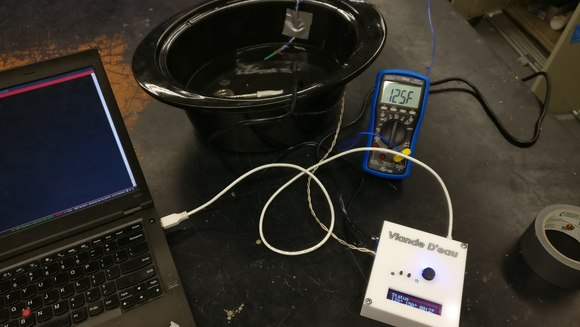
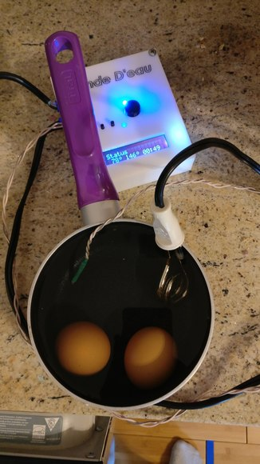
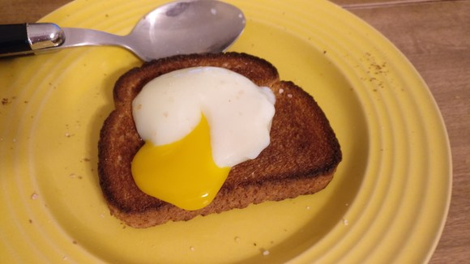

# Sous-Vide

My first PCB design project.

### Final Results!

### Materials

see [sous-vide_bom.csv](./kicad_proj/sous-vide_bom_0.3.csv)

### Schematic

see [sous-vide.sch](./kicad_proj/sous-vide.sch)

### PCB

see [sous-vide.kicad_pcb](./kicad_proj/sous-vide.kicad_pcb)

Mains power is scary. I used this to calculate trace width/clearance: http://www.desmith.net/NMdS/Electronics/TraceWidth.html

### Revision Notes

 - Hole size of screw terminals are too small. Should be 1.8542mm
 - Screw terminals are a bad idea, use IEC connector
 - Higher power heater
 - Buzzer/Dinger!
 - One wire for thermistor/heater
 - Something to stir the water around
 - Label on V+ and V- on heater are backwards (J1)
 - Button footprint is wrong

